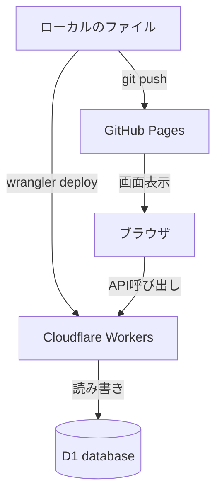

# study-log

## このアプリについて

学習ログを記録し、科目ごとの累計時間や自己採点を管理するアプリです。

### 主な機能

- Googleアカウントでのログイン(Google Identity Services)
- 科目ごとの学習ログ記録(日付・学習時間・学習内容・自己採点)
- 日/週/月単位/年単位での集計グラフ表示、科目別の割合表示
- 科目ごとの累計学習時間に応じた5段階チャレンジ表示(20h / 100h / 1000h / 5000h / 10000h)

### 技術構成

| レイヤー | 技術 |
|---|---|
| フロントエンド | 素のHTML / CSS / JavaScript、Chart.js |
| バックエンド | Cloudflare Workers |
| データベース | Cloudflare D1(SQLite互換) |
| 認証 | Google Identity Services(IDトークン方式) |

---

## デプロイと運用

このアプリは、**フロントエンド**と**バックエンド**が別々の場所にデプロイされる構成になっています。それぞれ反映方法が異なるため、更新時は注意が必要です。

### 構成

| 役割 | 実体 | ホスティング先 | 反映方法 |
|---|---|---|---|
| フロントエンド | `index.html` | GitHub Pages | `git push` |
| バックエンド(API) | `src/index.js` | Cloudflare Workers | `npx wrangler deploy` |
| データベース | `db/*.sql` で定義 | Cloudflare D1(`study_log_db`) | `npx wrangler d1 execute` |

**重要:** `git push` はGitHub Pages(画面)のみを更新します。Cloudflare Workers(API・認証・DB処理)は`git push`とは無関係に動いており、Workerを更新するには`npx wrangler deploy`が別途必要です。



### デプロイ手順

#### 1. フロントエンドを更新したとき(`index.html`)

```powershell
git add .
git commit -m "<変更内容を記述>"
git push
```

数分待つと GitHub Pages に自動反映されます。反映状況は以下で確認できます。

```
https://github.com/<GitHubユーザー名>/study-log/settings/pages
```

#### 2. バックエンドを更新したとき(`src/index.js`)

`git push`だけでは反映されません。以下を実行してください。

```powershell
git add .
git commit -m "<変更内容を記述>"
git push
npx wrangler deploy
```

デプロイ後、Workerの本番URLに対して動作確認してください。

```
https://study-log-worker.<アカウント名>.workers.dev
```

#### 3. データベースのテーブル構造を変更したとき(`db/*.sql`)

新しいMigrationファイルを作成した場合、ローカルでの動作確認後、本番D1に個別に適用します。

```powershell
npx wrangler d1 execute study_log_db --remote --file=./db/<新しいmigrationファイル名>.sql
```

適用後、テーブル構造を確認します。

```powershell
npx wrangler d1 execute study_log_db --remote --command="PRAGMA table_info(<確認したいテーブル名>)"
```

### ローカルでの動作確認

デプロイ前に、ローカルで動作確認することを推奨します。

```powershell
npx wrangler dev
```

### 開発環境のセットアップ(初回のみ)

`.dev.vars` ファイルをプロジェクトルートに作成し、以下の内容を記載してください(このファイルはGit管理対象外です)。

```
GOOGLE_CLIENT_ID=<Google Cloud ConsoleのOAuthクライアントID>
SESSION_SECRET=<任意のランダムな文字列>
```

本番用のシークレットは以下のコマンドで個別に設定します(値は対話的に入力するため、コマンド自体に値は含みません)。

```powershell
npx wrangler secret put GOOGLE_CLIENT_ID
npx wrangler secret put SESSION_SECRET
```

### Google Cloud Console 側の設定

OAuthクライアントIDの「承認済みのJavaScript生成元」に、以下を登録してください。

- `https://<GitHubユーザー名>.github.io`(本番)
- `http://127.0.0.1:3000`(ローカル開発用)
